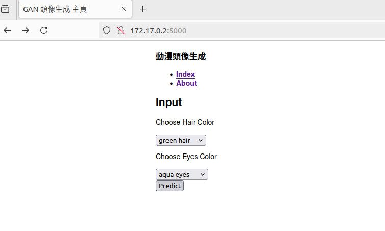
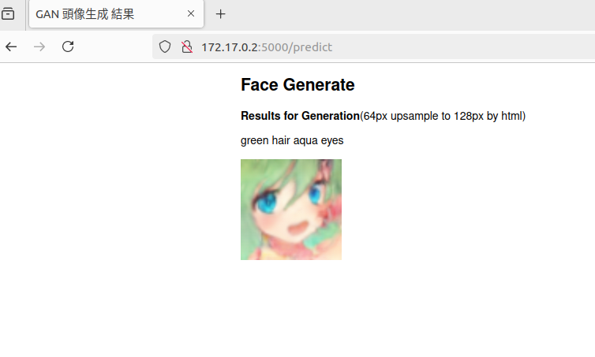

此為將[GAN生成](https://github.com/ChuanYenWu/conditional_gan "link")當中的stage1 Generator部分的模型架構連同參數包裝成torchscript，並放入Docker中，搭配Flask作成簡單的網頁。<br>
<br>
建立IMAGE(映像檔):<br>
```sudo docker image build -t flaskpy:v01 .```
<br>
建立及執行container(結束後自動刪除container):<br>
```sudo docker container run -p 5000:5000 --rm -it flaskpy:v01```
<br>
<br>

頁面展示(可以透過選單選擇髮色及瞳色)<br>

<br>
結果頁面<br>

<br>
